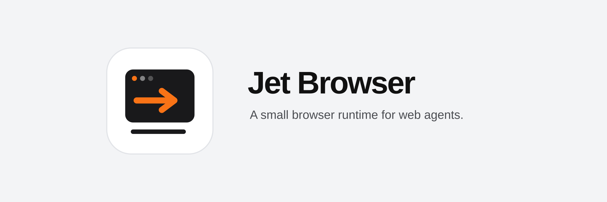
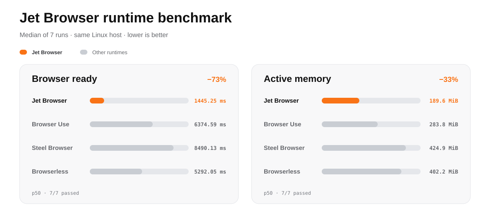

  

<a href="./README.md">English</a> · <a href="./README.zh-CN.md">简体中文</a> · <a href="./README.ja.md">日本語</a> · <a href="./README.ko.md">한국어</a> · Deutsch · <a href="./README.fr.md">Français</a> · <a href="./README.es.md">Español</a> · <a href="./README.pt-BR.md">Português</a>

Jet Browser bündelt einen echten WPE-WebKit-Browser und eine Rust-WebDriver-Bridge als eigenständige Laufzeit für Agenten. Pro Container läuft eine isolierte Sitzung; geordnete JSON-Befehle werden über die Standardeingabe gesendet und maschinenlesbare Ergebnisse über die Standardausgabe empfangen.

Es sind weder Konto noch API-Schlüssel, Datenbank oder gehostete Steuerungsebene erforderlich.

## Schnellstart

Benötigt werden Docker und Node.js 24+. Der Test führt Browserstart, lokale Navigation, native Eingabe, DOM-Prüfung, Screenshot und Beenden in einem Container ohne Netzwerk aus.

~~~bash
git clone https://github.com/masakaai/jet-browser.git
cd jet-browser
npm run standalone
~~~

## Reproduzierbarer Laufzeit-Benchmark

Jet Browser erreichte eine verifizierte Seite in **1.445,25 ms** bei **189,6 MiB** aktivem Speicher—**72,7 % weniger Bereitschaftszeit** und **33,2 % weniger Speicher** als das nächstbeste Ergebnis. [Methode](./docs/benchmarks.md) · [Rohdaten](./benchmarks/results/runtime-2026-10-07.json)

## Open-Source-Kern

- WPE WebKit 2.54 und ein headless Wayland-Compositor
- geordnete JSONL-Automatisierungs-Bridge in Rust
- Zeiger, Tastatur, Text, Touch, Mausrad, Drag, Navigation und Tabs
- Titel, URL, JavaScript-Auswertung, Screenshots und semantisches DOM
- Cookie- und Web-Storage-Import/-Export über explizite Profilpfade
- optionale Komponenten für Visual frames, Live DOM, menschliche Steuerung und verteilte Worker

Der Kernpfad lautet Agent → JSONL → jet-wpe → WebDriver → WPE WebKit. Im Standalone-Modus werden weder Anwendungsserver noch Datenbankclient, Tunnel, Zahlungs-SDK oder bestimmtes Agent-Framework installiert.

Mehr unter [Architektur](./docs/architecture.md) und [Standalone-Demo](./docs/demo.md).

## Entwicklung und Prüfung

~~~bash
npm ci
npm test
cargo test --all-targets
docker build -f Dockerfile.standalone -t jet-browser:local .
~~~

Jet Browser ist Browser-Infrastruktur und kein LLM- oder Agenten-Framework. Lizenziert unter der [Apache License 2.0](./LICENSE).
