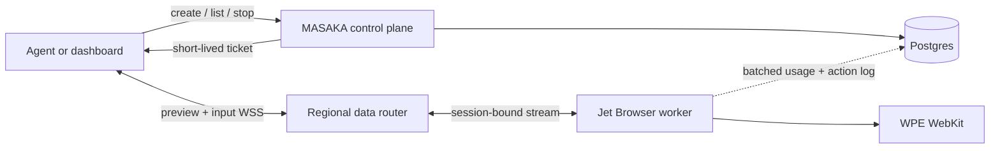

# Jet Browser

<p align="center">
  <strong>Real browser infrastructure for web agents.</strong><br>
  WPE WebKit sessions, human takeover, persistent state, and a direct real-time data plane.
</p>

<p align="center">
  <a href="https://masaka-ai.vercel.app">Website</a> ·
  <a href="https://masaka-ai.vercel.app/dashboard.html">Dashboard</a> ·
  <a href="https://masaka-ai.vercel.app/docs.html">Documentation</a> ·
  <a href="./docs/benchmarks.md">Benchmarks</a>
</p>

<p align="center">
  English · <a href="./README.zh-CN.md">简体中文</a> · <a href="./README.ja.md">日本語</a> · <a href="./README.ko.md">한국어</a> · <a href="./README.de.md">Deutsch</a> · <a href="./README.fr.md">Français</a> · <a href="./README.es.md">Español</a> · <a href="./README.pt-BR.md">Português</a>
</p>


[](https://github.com/masakaai/jet-browser/actions/workflows/ci.yml)

Jet Browser is the browser runtime behind MASAKA. It runs isolated WPE WebKit sessions for agents and lets a person watch, take control, and return the same session to the agent. Preview and input use session-bound WebSockets; Vercel, Supabase Realtime, and Postgres stay outside the interaction hot path.


## What it provides

| Capability | Implementation |
| --- | --- |
| Real browser | WPE WebKit 2.54 with a Rust WebDriver bridge |
| Live preview | Visual frames or semantic Live DOM, selected before launch |
| Human takeover | Pointer, keyboard, touch, wheel, drag, navigation, and tabs |
| Agent handoff | Epoch-fenced agent/human control prevents stale input |
| Persistent state | Encrypted cookies, local/session storage, IndexedDB, and CacheStorage |
| Downloads | Bounded download lifecycle, metadata, and authenticated retrieval |
| Network safety | DNS/IP validation blocks loopback, link-local, private, and reserved egress |
| Scale and regions | Demand-driven regional worker pools with warm spare capacity |
| Billing integrity | Session leases, heartbeats, bounded runtime, and server-side settlement |

## Quickstart

Requirements: Node.js 24+, a MASAKA account, a project, and a server-side API key from the dashboard.

```bash
git clone https://github.com/masakaai/jet-browser.git
cd jet-browser
npm ci
export MASAKA_API_KEY=msk_your_server_key
npm run demo
```

The demo creates one bounded session, reads the page title, and stops the session in `finally`.

```js
import { MasakaBrowser } from './sdk/client.mjs';

const browser = new MasakaBrowser({ apiKey: process.env.MASAKA_API_KEY });
const session = await browser.create({
  url: 'https://example.com',
  region: 'overseas',
  maxSeconds: 120
});

try {
  await browser.waitForReady(session.id);
  const page = await browser.evaluate(session.id, `({
    title: document.title,
    url: location.href
  })`);
  console.log(page);
} finally {
  await browser.stop(session.id);
}
```

Use `sdk/browser.mjs` in signed-in web and mobile clients. It exchanges the user's access token for a short-lived session ticket, then connects directly to the assigned worker. Service-role keys and MASAKA API keys must never be bundled into a public client.

For agent frameworks, `sdk/tools.mjs` provides versioned tool identities, JSON Schema declarations, collision checks, and execution binding over one existing session. The default catalog excludes arbitrary JavaScript evaluation. See [Agent tool catalog](./docs/agent-tools.md).

## Architecture



Only lifecycle, identity, billing, and asynchronous records use the control plane. Pointer, keyboard, touch, wheel, preview, and acknowledgements stay on the persistent data connection. See [Architecture](./docs/architecture.md).

## Reproducible benchmarks

The repository includes one harness and three provider adapters. The harness applies the same target page, viewport, sequential run count, title check, and cleanup rule to MASAKA, Browser Use Cloud, and Kernel.

```bash
# Run every provider whose key is present.
npm run benchmark -- --providers=masaka,browser-use,kernel --warmups=3 --runs=5

# MASAKA only.
npm run benchmark -- --providers=masaka --warmups=1 --runs=5 --out=benchmarks/results/local.json
```

Required variables are `MASAKA_API_KEY`, `BROWSER_USE_API_KEY`, and `KERNEL_API_KEY`. Missing credentials are reported as `skipped`, never as zero or failed performance. The latest verified MASAKA production sample and the measurement limitations are in [Benchmarks](./docs/benchmarks.md); the capability comparison is in [Provider comparison](./docs/comparison.md).

## Develop

```bash
npm ci
npm test
cargo test --all-targets
```

Build a worker image with an explicit version:

```bash
docker build -f Dockerfile.wpe-worker \
  -t masaka-jet-browser-wpe:0.6.5 .
```

The worker requires control-plane credentials, a ticket-signing secret, and a unique immutable worker ID. Keep deployment secrets in your secret manager or an untracked env file. Never commit them.

## Project map

- [`src/`](./src) — worker, direct data plane, capture, scaling, state, and security boundaries
- [`rust/`](./rust) — WebDriver bridge and native input/profile helpers
- [`sdk/`](./sdk) — trusted server SDK and signed-in browser/mobile SDK
- [`examples/`](./examples) — bounded, runnable integration examples
- [`benchmarks/`](./benchmarks) — reproducible provider-neutral runtime benchmark
- [`docs/`](./docs) — architecture, demos, benchmarks, and comparisons
- [`test/`](./test) — Node integration/unit regressions; Rust tests live beside their modules

## Scope

Jet Browser is browser infrastructure, not an LLM agent framework. Browser Use and similar frameworks can sit above it; MASAKA Agent Harness is a separate product layer. Jet Browser currently exposes its ordered action API and direct preview/input protocol, not a public CDP endpoint.

Read [Demo guide](./docs/demo.md), [Kernel open-source design review](./docs/kernel-open-source-review.md), [Contributing](./CONTRIBUTING.md), and [Security](./SECURITY.md) before deploying or changing the protocol.
