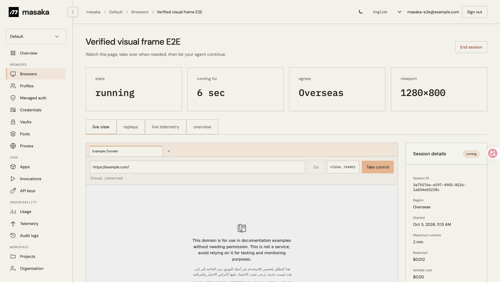

# Jet Browser

<p align="center"><strong>Infraestrutura de navegador real para agentes web.</strong><br>Sessões WPE WebKit, controle humano, estado persistente e um caminho de dados direto em tempo real.</p>

<p align="center"><a href="./README.md">English</a> · <a href="./README.zh-CN.md">简体中文</a> · <a href="./README.ja.md">日本語</a> · <a href="./README.ko.md">한국어</a> · <a href="./README.de.md">Deutsch</a> · <a href="./README.fr.md">Français</a> · <a href="./README.es.md">Español</a> · Português</p>

Jet Browser é o runtime de navegador da MASAKA. Ele executa sessões WPE WebKit isoladas para agentes e permite que uma pessoa observe, assuma o controle e devolva a mesma sessão ao agente. A visualização e as entradas usam WebSockets vinculados à sessão; Vercel, Supabase Realtime e Postgres ficam fora do caminho interativo crítico.



## Recursos

- WPE WebKit 2.54 com bridge WebDriver em Rust
- Frames Visual ou Live DOM semântico, escolhidos antes da inicialização
- Ponteiro, teclado, toque, roda, arrastar, navegação e abas
- Epoch fencing entre agente e pessoa contra entradas antigas
- Cookies, local/session storage, IndexedDB e CacheStorage criptografados
- Pools regionais, escala por demanda e liquidação no servidor

## Início rápido

É necessário Node.js 24+ e uma API key de servidor criada no Dashboard.

```bash
git clone https://github.com/masakaai/jet-browser.git
cd jet-browser
npm ci
export MASAKA_API_KEY=msk_your_server_key
npm run demo
```

A demo cria uma única sessão limitada, lê o título real da página e sempre encerra a sessão em `finally`.

```bash
npm run verify
npm run benchmark -- --providers=masaka,browser-use,kernel --runs=5
```

O benchmark usa a mesma URL, viewport, execução sequencial e regra de limpeza. Um provedor sem credenciais é registrado como `skipped`. Consulte [Arquitetura](./docs/architecture.md), [Benchmarks](./docs/benchmarks.md), [Comparação](./docs/comparison.md) e [Demo](./docs/demo.md).

Jet Browser é infraestrutura de navegador, não um framework de agente LLM. A interface pública atual é a API session/action da MASAKA e o protocolo de visualização/entrada, não um endpoint CDP genérico.
