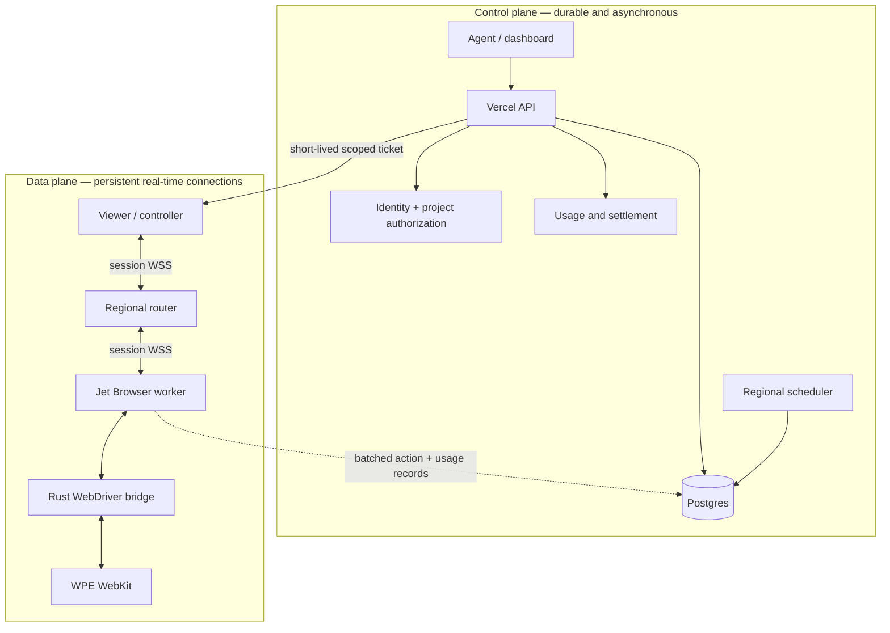
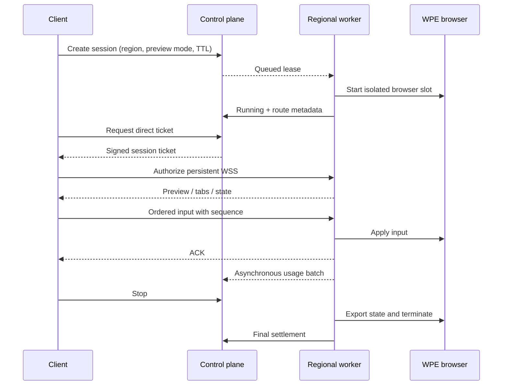

# Architecture

Jet Browser separates durable control-plane work from latency-sensitive browser traffic.

## Request paths

The real-time path does not synchronously call Vercel, Supabase Realtime, Postgres, or object storage for each frame or input. The control plane creates the session and issues a short-lived ticket; the viewer then connects to the assigned regional router.

Each worker exposes aggregate Prometheus metrics on `GET /metrics` only when a dedicated `MASAKA_METRICS_TOKEN` is configured, and requires that token as a bearer credential. The route remains protected even when the data-plane listener is forwarded by a standalone tunnel. Metrics intentionally omit session, account, project, URL, and worker labels; operators receive queue/buffer/failure signals without turning user identifiers into a telemetry surface.

## Session lifecycle

## Preview modes

Preview mode is chosen before launch so the worker does not pay for two capture systems.

- **Visual** sends changed PNG frames captured from the compositor. Static frames are not repeated. It is the compatibility-first default for arbitrary sites.
- **Live DOM** sends a semantic DOM/CSSOM snapshot followed by mutations. It can use less steady-state bandwidth but cannot reproduce every canvas, media, cross-origin frame, or browser-native surface.

Clients must acknowledge reliable semantic snapshots. Both modes apply bounded queues and backpressure; input acknowledgements have priority over replaceable preview work.

## Input and control

The worker maintains one monotonically increasing control epoch. Taking or releasing control advances the epoch, so commands from a stale agent or viewer cannot mutate the new controller's session. Reliable actions remain ordered. Replaceable pointer movement and wheel deltas may be coalesced under pressure.

Supported operations include pointer phases, keyboard events, text, touch mapping, wheel, drag, navigation, snapshots, tab create/switch/close, downloads, and exact-hostname credential fill.

## State and isolation

Each session has its own runtime directory, Wayland socket, browser process, lease, and direct connection scope. Persisted profiles are owner- and project-bound, encrypted before storage, and subject to retention. The interoperable profile set currently includes cookies, local/session storage, IndexedDB records, and CacheStorage.

Browser processes receive a minimal environment without database, service-role, payment, or ticket-signing secrets. Outbound destinations are checked after DNS resolution; loopback, link-local, private, metadata, and reserved ranges are blocked.

## Scaling and regions

Workers register one immutable region and claim only matching sessions. The autoscaler computes demand from queued and active sessions, keeps warm spare capacity, respects real host CPU/memory/launch headroom, and drains idle workers before stopping them. Capacity is still bounded by the physical host and configured safety budgets; an autoscaler is not evidence of unlimited concurrency.

## Current protocol boundary

The public integration surface is the MASAKA session/action SDK plus the signed-in direct preview/input protocol. Jet Browser does not currently publish a general CDP endpoint. Chromium-only extensions, Chrome policies, and CDP-specific tooling therefore require a separate Chromium execution tier rather than pretending WPE implements those contracts.

The rationale and exact upstream revisions behind recent SDK, runtime-metrics, and tool-catalog decisions are recorded in [Kernel open-source design review](./kernel-open-source-review.md).
